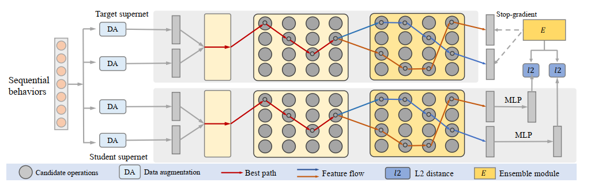

### NASR

---

Pytorch implementation for WWW'22 paper:

> Towards Automatic Discovering of Deep Hybrid Network Architecture for Sequential Recommendation

### Introduction

---

In this work, we use network architecture search(NAS) with self-supervised learning to find a hybrid&suitable architecture on a given dataset adaptively in sequential recommendation. The framework is illustrated as follows:



### Requirements

---
 - pytorch 1.x
 - pandas
 - numpy
 - tqdm

### Usage

---

```python
python main.py --data_path your_path --max_len seq_len
```

For more detailed params, please refer to args.py

### Results

---

We performed our NASR on two datasets of Movielens and LastFM, and the result tested on Movielens is shown as follows:

>for fair comparison, all the models are trained in auto-regressive manner

|               | NDCG@20    | Recall@20  | NDCG@10    | Recall@10  |
| ------------- | ---------- | ---------- | ---------- | ---------- |
| GRU4Rec       | 0.1587     | 0.3344     | 0.1347     | 0.2390     |
| Nextitnet     | 0.1653     | 0.3421     | 0.1413     | 0.2471     |
| SASRec        | 0.1665     | 0.3428     | 0.1428     | 0.2485     |
| Ramdom search | 0.1605     | 0.3395     | 0.1361     | 0.2426     |
| NASR          | **0.1793** | **0.3468** | **0.1548** | **0.2676** |

### Citation

---

TBD

